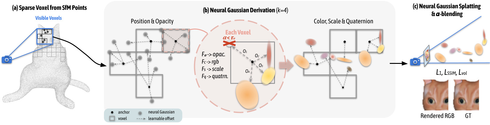

# Scaffold-GS: Structured 3D Gaussians for View-Adaptive Rendering

[Tao Lu](https://github.com/inspirelt), [Mulin Yu](https://scholar.google.com/citations?user=w0Od3hQAAAAJ), [Linning Xu](https://eveneveno.github.io/lnxu), [Yuanbo Xiangli](https://kam1107.github.io/), [Limin Wang](https://wanglimin.github.io/), [Dahua Lin](http://dahua.site/), [Bo Dai](https://daibo.info/) <br />


[[`Project Page`](https://city-super.github.io/scaffold-gs/)][[`arxiv`](https://arxiv.org/abs/2312.00109)][[`Viewer`](https://drive.google.com/file/d/17nPVnRRxO4zMQJ_fKHm13HzvD0wUZ8XF/view?usp=sharing)]

## News

**[2024.09.25]** 🎈We propose **Octree-AnyGS**, a general anchor-based framework that supports explicit Gaussians (2D-GS, 3D-GS) and neural Gaussians (Scaffold-GS). Additionally, **Octree-GS** has been adapted to the aforementioned Gaussian primitives, enabling Level-of-Detail representation for large-scale scenes. This framework holds potential for application to other Gaussian-based methods, with relevant SIBR visualizations forthcoming.(https://github.com/city-super/Octree-AnyGS)

**[2024.05.28]**  We update the [viewer](https://github.com/city-super/Scaffold-GS/tree/main/SIBR_viewers) to conform to the file structure at training.

**[2024.04.05]**  Scaffold-GS is selected as a 🎈**highlight** in CVPR2024.

**[2024.03.27]**  🎈We release [Octree-GS](https://city-super.github.io/octree-gs), supporting an explicit *LOD* representation, rendering faster in large-scale scene with high quality.

**[2024.03.26]**  🎈We release [GSDF](https://city-super.github.io/GSDF/), which improves rendering and reconstruction quality simultaneously.

**[2024.02.27]**  Accepted to [CVPR 2024](https://cvpr.thecvf.com/).

**[2024.01.22]**  We add the appearance embedding to Scaffold-GS to handle wild scenes.

**[2024.01.22]** 🎈👀 The [viewer](https://github.com/city-super/Scaffold-GS/tree/main/SIBR_viewers) for Scaffold-GS is available now. 

**[2023.12.10]** We release the code.

## TODO List
- [ ] Explore on removing the MLP module
- [ ] Improve the training configuration system

## Overview

<p align="center">

</p>


We introduce Scaffold-GS, which uses anchor points to distribute local 3D Gaussians, and predicts their attributes on-the-fly based on viewing direction and distance within the view frustum.

Our method performs superior on scenes with challenging observing views. e.g. transparency, specularity, reflection, texture-less regions and fine-scale details.

<p align="center">

</p>


## Installation

We tested on a server configured with Ubuntu 18.04, cuda 11.6 and gcc 9.4.0. Other similar configurations should also work, but we have not verified each one individually.

1. Clone this repo:

```
git clone https://github.com/city-super/Scaffold-GS.git --recursive
cd Scaffold-GS
```

2. Install dependencies

```
SET DISTUTILS_USE_SDK=1 # Windows only
conda env create --file environment.yml
conda activate scaffold_gs
```

## Data

First, create a ```data/``` folder inside the project path by 

```
mkdir data
```

The data structure will be organised as follows:

```
data/
├── dataset_name
│   ├── scene1/
│   │   ├── images
│   │   │   ├── IMG_0.jpg
│   │   │   ├── IMG_1.jpg
│   │   │   ├── ...
│   │   ├── sparse/
│   │       └──0/
│   ├── scene2/
│   │   ├── images
│   │   │   ├── IMG_0.jpg
│   │   │   ├── IMG_1.jpg
│   │   │   ├── ...
│   │   ├── sparse/
│   │       └──0/
...
```


### Public Data

The BungeeNeRF dataset is available in [Google Drive](https://drive.google.com/file/d/1nBLcf9Jrr6sdxKa1Hbd47IArQQ_X8lww/view?usp=sharing)/[百度网盘[提取码:4whv]](https://pan.baidu.com/s/1AUYUJojhhICSKO2JrmOnCA). The MipNeRF360 scenes are provided by the paper author [here](https://jonbarron.info/mipnerf360/). And we test on scenes ```bicycle, bonsai, counter, garden, kitchen, room, stump```. The SfM data sets for Tanks&Temples and Deep Blending are hosted by 3D-Gaussian-Splatting [here](https://repo-sam.inria.fr/fungraph/3d-gaussian-splatting/datasets/input/tandt_db.zip). Download and uncompress them into the ```data/``` folder.

### Custom Data

For custom data, you should process the image sequences with [Colmap](https://colmap.github.io/) to obtain the SfM points and camera poses. Then, place the results into ```data/``` folder.


## Training

### Training multiple scenes

To train multiple scenes in parallel, we provide batch training scripts: 

 - Tanks&Temples: ```train_tnt.sh```
 - MipNeRF360: ```train_mip360.sh```
 - BungeeNeRF: ```train_bungee.sh```
 - Deep Blending: ```train_db.sh```
 - Nerf Synthetic: base ->```train_nerfsynthetic.sh```; with warmup->```train_nerfsynthetic_withwarmup.sh```

 run them with 

 ```
bash train_xxx.sh
 ```

 > Notice 1: Make sure you have enough GPU cards and memories to run these scenes at the same time.

 > Notice 2: Each process occupies many cpu cores, which may slow down the training process. Set ```torch.set_num_threads(32)``` accordingly in the ```train.py``` to alleviate it.

### Training a single scene

For training a single scene, modify the path and configurations in ```single_train.sh``` accordingly and run it:

```
bash ./single_train.sh
```

- scene: scene name with a format of ```dataset_name/scene_name/``` or ```scene_name/```;
- exp_name: user-defined experiment name;
- gpu: specify the GPU id to run the code. '-1' denotes using the most idle GPU. 
- voxel_size: size for voxelizing the SfM points, smaller value denotes finer structure and higher overhead, '0' means using the median of each point's 1-NN distance as the voxel size.
- update_init_factor: initial resolution for growing new anchors. A larger one will start placing new anchor in a coarser resolution.

> For these public datasets, the configurations of 'voxel_size' and 'update_init_factor' can refer to the above batch training script. 


This script will store the log (with running-time code) into ```outputs/dataset_name/scene_name/exp_name/cur_time``` automatically.


## Evaluation

We've integrated the rendering and metrics calculation process into the training code. So, when completing training, the ```rendering results```, ```fps``` and ```quality metrics``` will be printed automatically. And the rendering results will be save in the log dir. Mind that the ```fps``` is roughly estimated by 

```
torch.cuda.synchronize();t_start=time.time()
rendering...
torch.cuda.synchronize();t_end=time.time()
```

which may differ somewhat from the original 3D-GS, but it does not affect the analysis.

Meanwhile, we keep the manual rendering function with a similar usage of the counterpart in [3D-GS](https://github.com/graphdeco-inria/gaussian-splatting), one can run it by 

```
python render.py -m <path to trained model> # Generate renderings
python metrics.py -m <path to trained model> # Compute error metrics on renderings
```

## Viewer

The [viewer](https://github.com/city-super/Scaffold-GS/tree/main/SIBR_viewers) for Scaffold-GS is available now. 

Recommended dataset structure in the source path location:

```
<location>
|---sparse
    |---0
        |---cameras.bin
        |---images.bin
        |---points3D.bin
```

or

```
<location>
|---points3D.ply
|---transforms.json
```

Recommended checkpoint  structure in the model path location:

```
<location>
|---point_cloud
|   |---point_cloud.ply
|   |---color_mlp.pt
|   |---cov_mlp.pt
|   |---opacity_mlp.pt
(|   |---embedding_appearance.pt)
|---cfg_args
|---cameras.json
(|---input.ply)
```


## Contact

- Tao Lu: taolu@smail.nju.edu.cn
- Mulin Yu: yumulin@pjlab.org.cn

## Citation

If you find our work helpful, please consider citing:

```bibtex
@inproceedings{scaffoldgs,
  title={Scaffold-gs: Structured 3d gaussians for view-adaptive rendering},
  author={Lu, Tao and Yu, Mulin and Xu, Linning and Xiangli, Yuanbo and Wang, Limin and Lin, Dahua and Dai, Bo},
  booktitle={Proceedings of the IEEE/CVF Conference on Computer Vision and Pattern Recognition},
  pages={20654--20664},
  year={2024}
}
```

## LICENSE

Please follow the LICENSE of [3D-GS](https://github.com/graphdeco-inria/gaussian-splatting).

## Acknowledgement

We thank all authors from [3D-GS](https://github.com/graphdeco-inria/gaussian-splatting) for presenting such an excellent work.
