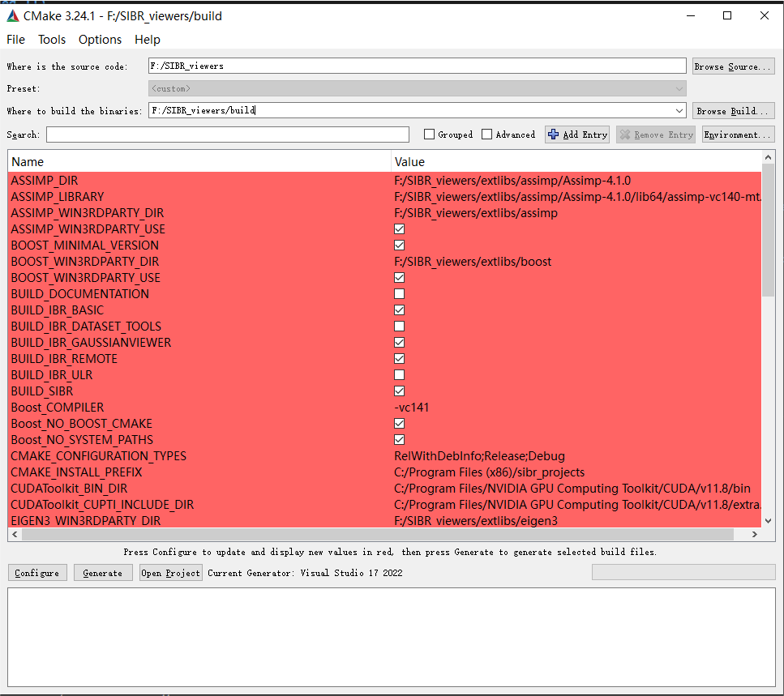
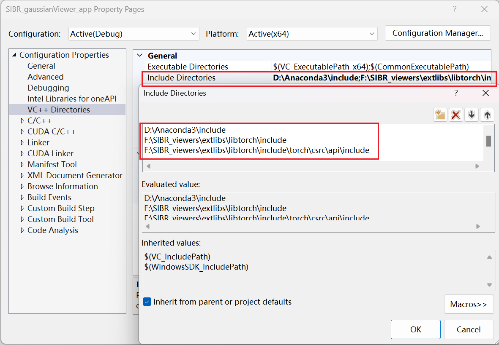
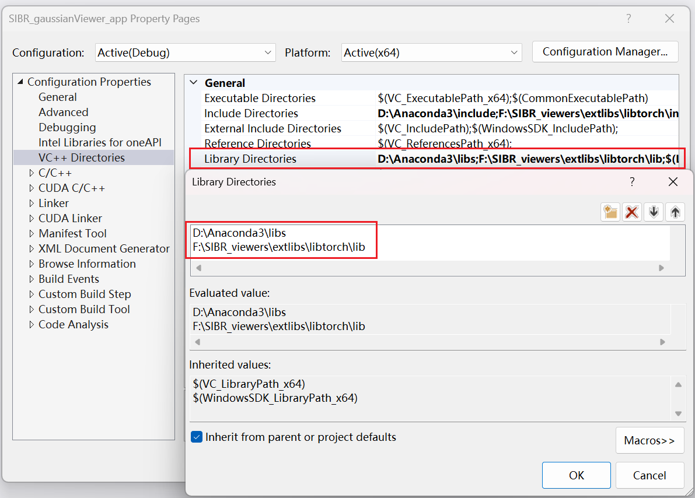
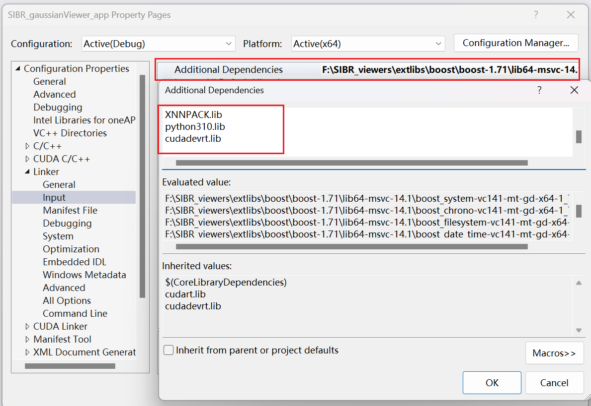
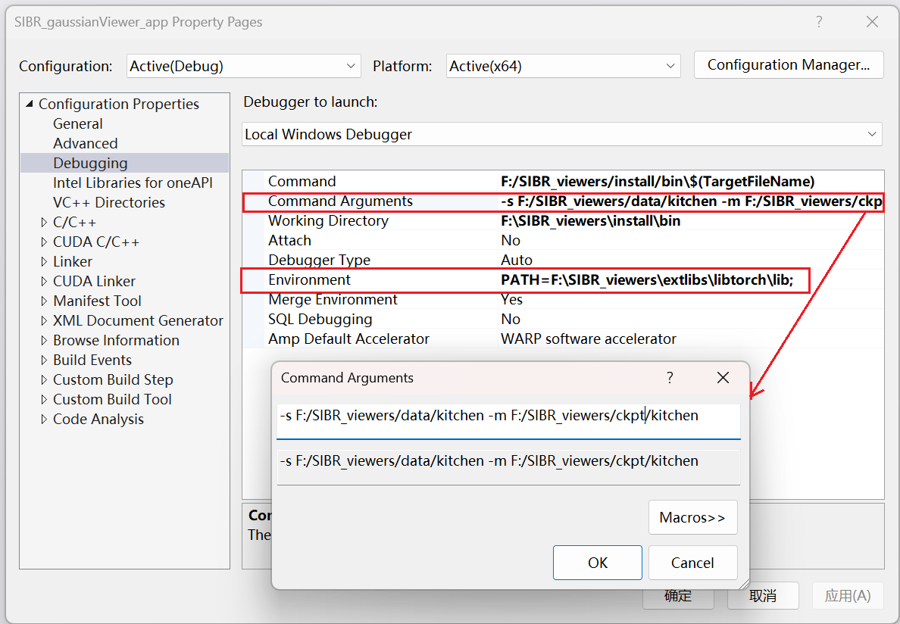
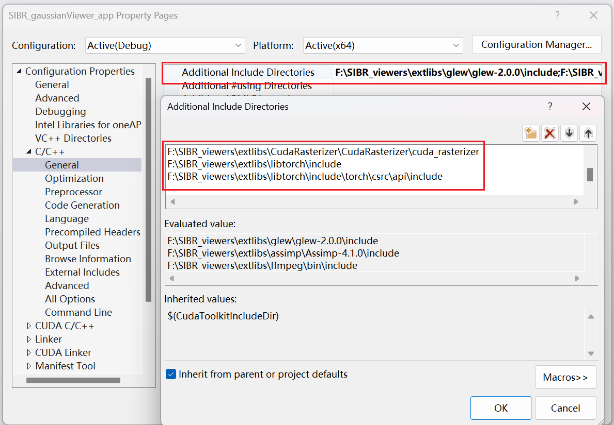
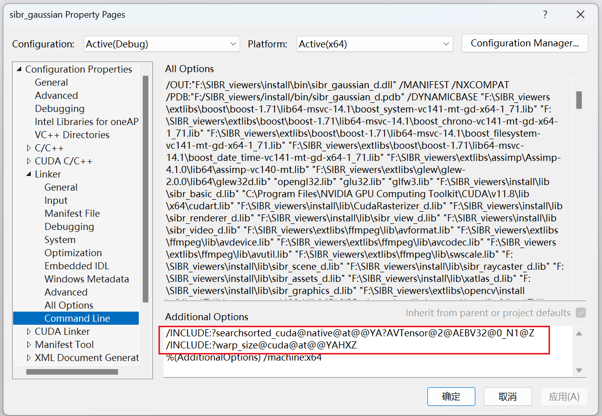

# Scaffold-GS-Viewer

We provide two interactive viewers for our method: remote and real-time (recommended). Our viewing solutions are based on the [SIBR](https://sibr.gitlabpages.inria.fr/) framework, developed by the GRAPHDECO group for several novel-view synthesis projects.

### Pre-built Windows Binaries

We provide pre-built binaries of **Real-Time Viewer** for Windows [here](https://drive.google.com/file/d/17nPVnRRxO4zMQJ_fKHm13HzvD0wUZ8XF/view?usp=sharing). Due to equipment and timing reasons, we can only guarantee a successful deployment in the Windows environment.

Examples : 

- [kitchen](https://drive.google.com/file/d/17iED9Lrgkp_vHdP7s0JXUEPuB68HUBr7/view?usp=sharing) in the [Mip-NeRF 360]((https://jonbarron.info/mipnerf360/)) Dataset;
- [florence_cathedral_side](https://drive.google.com/file/d/1QE59k_wG3qS3mtoEknzbbvRTo2as7p_r/view?usp=sharing) in the [IMW 2020]([Leaderboard - 2020 IMW Challenge (ubc.ca)](https://www.cs.ubc.ca/research/image-matching-challenge/2020/leaderboard/)) Dataset.

### Hardware Requirements

- OpenGL 4.5-ready GPU and drivers (or latest MESA software)
- 4 GB VRAM recommended
- CUDA-ready GPU with Compute Capability 7.0+ (only for Real-Time Viewer)

### Software RequirementsMarkdown All in One
Markdown All in One

- Visual Studio (we used Visual Studio 2022 for Windows)
- CUDA SDK 11 (we used 11.8)
- CMake (recent version, we used 3.24.1)
- Windows  (we used 11)

### Configuration

1) First, CMake can find and configure the required dependencies, and the CMake GUI is recommended.



2) Then, you need to download the appropriate version of `libtorch` for your CUDA environment. Here I used `1.10`. **! ! ! It should be noted that if you are compiling a `Debug` version, then you must download [the debug version of libtorch](https://drive.google.com/file/d/1ZqcI32kyDSpAdJEVRGmOIl42OepJkEB7/view?usp=drive_link), otherwise download [the release version of libtorch](https://drive.google.com/file/d/1UisC3Vpz7mzDf_xaClerHts0307lP0BY/view?usp=drive_link).**

#### VS configuration

In Virtual Studio, you need to configure both `SIBR_gaussianViewer_app` and `sibr_gaussian`. **! ! ! Without further emphasis, the following configuration is required for both projects.**

1. Start by adding `Include Directories` and the `Library Directories`. The first entry will be the include path for your **Python** environment, not necessarily for Anaconda.

   - Include Directories : 

     ```
     Path/to/Python(Anaconda)/include
     Path/to/libtorch/include
     Path/to/libtorch/include/torch/csrc/api/include
     ```

   - Library Directories : 

     ```
     Path/to/Python(Anaconda)/libs
     Path/to/libtorch/lib
     ```





2. After that, you need to add the lib files of **libtorch** in `Linker` → `Input` → `Additional Dependencies`, just to be sure we add all the libs and you also need to add `python{version}.lib` and `cudadevrt.lib`.

   - Libs recommended : 

     ```
     asmjit.lib
     c10.lib
     c10_cuda.lib
     caffe2_detectron_ops_gpu.lib
     caffe2_module_test_dynamic.lib
     caffe2_nvrtc.lib
     Caffe2_perfkernels_avx.lib
     Caffe2_perfkernels_avx2.lib
     Caffe2_perfkernels_avx512.lib
     clog.lib
     cpuinfo.lib
     dnnl.lib
     fbgemm.lib
     fbjni.lib
     kineto.lib
     libprotobuf-lited.lib
     libprotobufd.lib
     libprotocd.lib
     mkldnn.lib
     pthreadpool.lib
     pytorch_jni.lib
     torch.lib
     torch_cpu.lib
     torch_cuda.lib
     torch_cuda_cpp.lib
     torch_cuda_cu.lib
     XNNPACK.lib
     python310.lib
     cudadevrt.lib
     ```



3. In addition, since the executable requires additional parameters and environment variables, we add them in `Debugging` → `Command Arguments` and `Environment` respectively.

   - Command Arguments

     ```
     -s Path/to/data -m Path/to/ckpt
     ```

   - Environment

     ```
     Path/to/libtorch/lib
     ```



4. Then, we add the required libtorch include directories in `C/C++` → `General` → `Additional Include Directories`.

   - Additional Include Directories

     ```
     Path/to/libtorch/include
     Path/to/libtorch/include/torch/csrc/api/include
     ```



5) In case libtorch CUDA is not available, add the following command to `Linker` → `Command line` → `Additional Options`.

```
/INCLUDE:?searchsorted_cuda@native@at@@YA?AVTensor@2@AEBV32@0_N1@Z
/INCLUDE:?warp_size@cuda@at@@YAHXZ
```



### Navigation in SIBR Viewers
The SIBR interface provides several methods of navigating the scene. By default, you will be started with an FPS navigator, which you can control with ```W, A, S, D, Q, E``` for camera translation and ```I, K, J, L, U, O``` for rotation. Alternatively, you may want to use a Trackball-style navigator (select from the floating menu). You can also snap to a camera from the data set with the ```Snap to``` button or find the closest camera with ```Snap to closest```. The floating menues also allow you to change the navigation speed. You can use the ```Scaling Modifier``` to control the size of the displayed Gaussians, or show the initial point cloud.

### Running the Network Viewer

You can run the compiled ```SIBR_remoteGaussian_app(_d/_rwdi).exe``` in ```<SIBR install dir>/bin```, e.g.: 
```shell
Debug: ./<SIBR install dir>/bin/SIBR_remoteGaussian_app_d.exe
RelWithDebInfo: ./<SIBR install dir>/bin/SIBR_remoteGaussian_app_rwdi.exe
Release: ./<SIBR install dir>/bin/SIBR_remoteGaussian_app_rwdi.exe
```
The operation Settings of our viewer are the same as the original viewer.

### Running the Real-Time Viewer


You can run the compiled ```SIBR_remoteGaussian_app(_d/_rwdi).exe```  in ```<SIBR install dir>/bin```, e.g.: 
```shell
Debug: ./<SIBR install dir>/bin/SIBR_gaussianViewer_app_d.exe -s <path to data>  -m <path to ckpt>
RelWithDebInfo: ./<SIBR install dir>/bin/SIBR_remoteGaussian_app_rwdi.exe  -s <path to data>  -m <path to ckpt>
Release: ./<SIBR install dir>/bin/SIBR_remoteGaussian_app_rwdi.exe  -s <path to data>  -m <path to ckpt>
```

The operation Settings of our viewer are the same as the original viewer. Also, you need to add the missing .dll file to `./<SIBR install dir>/bin`.

**To unlock the full frame rate, please disable V-Sync on your machine and also in the application (Menu &rarr; Display). In a multi-GPU system (e.g., laptop) your OpenGL/Display GPU should be the same as your CUDA GPU (e.g., by setting the application's GPU preference on Windows, see below) for maximum performance.**


In addition to the initial point cloud and the splats, you also have the option to visualize the Gaussians by rendering them as ellipsoids from the floating menu.
SIBR has many other functionalities, please see the [documentation](https://sibr.gitlabpages.inria.fr/) for more details on the viewer, navigation options etc. There is also a Top View (available from the menu) that shows the placement of the input cameras and the original SfM point cloud; please note that Top View slows rendering when enabled. The real-time viewer also uses slightly more aggressive, fast culling, which can be toggled in the floating menu. If you ever encounter an issue that can be solved by turning fast culling off, please let us know.

## Default dataset/checkpoint structure 

Recommended dataset structure in the source path location:

```
<location>
|---sparse
    |---0
        |---cameras.bin
        |---images.bin
        |---points3D.bin
```

or

```
<location>
|---points3D.ply
|---transforms.json
```

Recommended checkpoint  structure in the model path location:

```
<location>
|---point_cloud
|   |---point_cloud.ply
|   |---color_mlp.pt
|   |---cov_mlp.pt
|   |---opacity_mlp.pt
(|   |---embedding_appearance.pt)
|---cfg_args
|---cameras.json
(|---input.ply)
```
## Acknowledgement

This repository is heavily based on SIBR viewers in [gaussian-splatting](https://github.com/graphdeco-inria/gaussian-splatting). Thanks to their great work!
